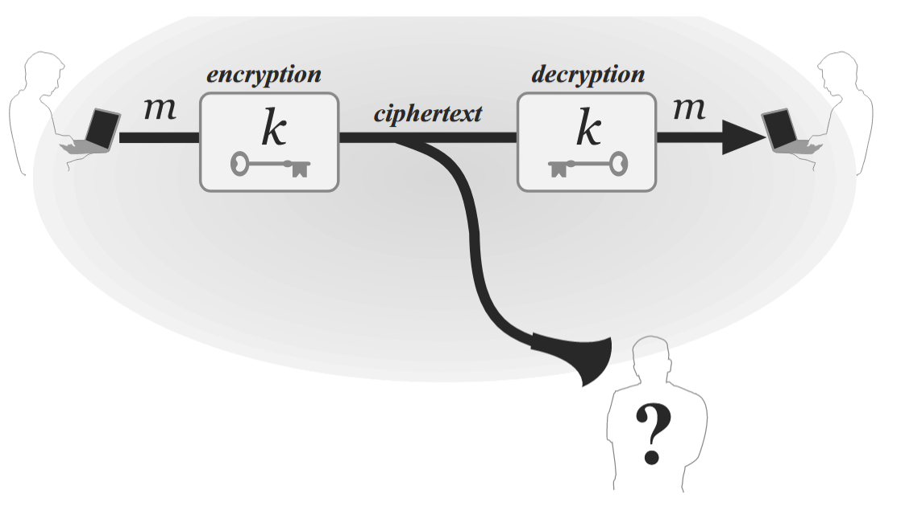
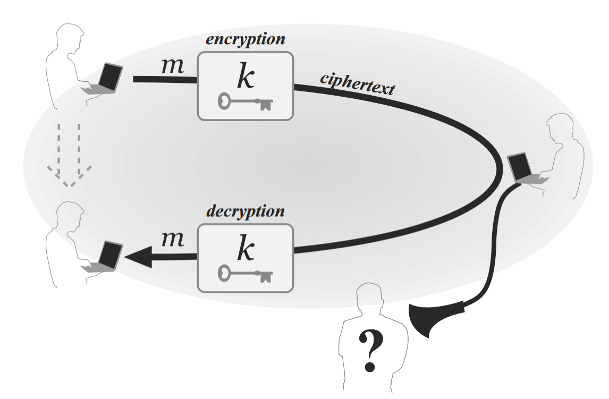

# 1.1 密码学和现代密码学

> **核心问题：什么是密码学？**

1. 从概念上来界定
	《简明牛津英语词典》(第9版)将密码学定义为"书写或求解代码的艺术"。——这个定义在历史上是准确的（知道20世纪晚期，密码学在很大程度上依然是一门艺术）
	
	但是现在的密码学包含的内容太多了，远不是原来定义的那样。
	
	简单来说，现代密码学是一门涉及数据信息安全、系统和对抗攻击的分布式计算的数学技术研究。

2. 时间分水岭
	20世纪70-80年代，密码学这种“艺术性”发生的根本性的变化。（因为有新的理论的产生）使得密码学开始作为一门科学和数学学科的研究变得严谨。

3. 应用场景不同
	经典密码学（20世纪80年代以前）：密码学的服务对象是军事组织和政府。
	
	现在密码无处不在。
	
	简而言之，密码学已经从**一组启发式**的技术，用于确保少数小众应用的秘密通信，成为了一门科学，普通人也能广泛地使用。

---

上述的论述只是对古典密码学的一个非正式的讨论，让我们大概有一个印象和了解，要想了解这段历史应该去看相应的参考文献。

---

我们上述的讨论并没有真正地解决什么是密码学，这个核心的问题。这个问题可能一时间不能够给出一个完整且满意地回答，当我们学习完这本书之后再来回答这个问题。

但在这里我们可以先给他做一个**可能不那么准确的定义**，方便我们后续的一个理解。

>**什么是密码学？**
>
>**密码学 (Cryptography)** 是研究信息**机密性、完整性、实体认证及不可否认性**的科学与技术。 它以数学（尤其是数论、概率论）为基础，通过对信息进行**变换**，确保信息在存储或传输过程中，即便被第三方截获，也无法提取有效内容或进行恶意篡改。
>
>密码学真正迷人的地方在于：**它用确定性的数学，在不确定的网络世界里构建了信任。**

---

# 1.2 私钥加密设置

>**同样地，核心问题：什么是私钥？什么是私钥加密设置？**

## 1.2.1 引言
古典密码学：
	致力于设计和使用密码（或密码系统），使双方能够在传递消息时，将这些消息隐藏于能够监听其间所有通信的窃听者视线之外。
	简单来说就是，设计一种只有我们双方能看懂的密码。哪怕是有敌手，要么敌手监听不到，要么监听了但不知道我的具体内容是什么。

**所有经典加密方案的安全性都依赖一个秘密，即密钥。密钥是通信双方事先共享的，而敌手不知道的。**

由上述密钥的一个概念，引出我们**私钥设置**

>**私钥设置**：通信双方预先**共享**某些秘密的信息，这种设置被称为私钥（或共享密钥/秘密密钥）设置。
>
>**问题**：共享那些信息？为什么共享的秘密信息可以作为我们所谓的私钥？使用私钥如何对信息完成的加密？如何实现这个共享过程？怎么保证这个共享的过程时安全可信的？

## 1.2.2 私钥加密过程
- 私钥加密的过程
	在上述我们传递消息的这个背景下（信息传递的双方，以及双方通信过程中有敌手）
	
	首先，双方想要安全通信的时，会事先共享一个只有双方知道的密钥，并使用这个密钥。
	
	通信时，一方可使用共享密钥对消息（或明文）进行加密（即“扰码”），从而生成密文并发送给接收方。接收方使用相同的密钥对密文进行解密（即“解扰”），最终还原原始消息。
	
	**同一密钥**用于将明文转换为密文并反向转换；因此该设置也被称为**对称密钥设置**，其对称性体现在双方持有相同的密钥用于加密和解密。这与非对称加密（或称公钥加密，详见第11章）形成对比——后者在加密和解密过程中使用不同的密钥。

>**为什么要加密？**
>
>加密的目标是防止监听者通过监控通信信道并观察密文来窥探明文内容。

## 1.2.3**私钥密码学的典型应用场景**

两大典型场景
	1.通信双方处于空间隔离状态；
		
	2.同一主体在不同时间点与自身进行通信。
		

## 1.2.4 私钥加密的语法

严格来说，私钥加密方案通过指定消息空间M及三种算法来定义：密钥生成过程（Gen）、加密过程（Enc）和解密过程（Dec）。消息空间M定义了“合法”消息的集合，即该方案支持的消息类型。

- 密钥生成算法Gen是一种**概率算法**，它输出一个根据某种分布选择的密钥k。密钥生成算法输出的所有可能的密钥的集合称为密钥空间，记为K。通常，Gen只是从密钥空间中**均匀**地选择一个密钥
	
- 加密算法Enc将密钥k和消息m作为输入，输出密文c。我们用Enck ( m )表示用密钥k对明文m的加密。
	
- 解密算法Dec将密钥k和密文c作为输入，输出明文m。我们用Deck ( c )表示用密钥k对密文c进行解密。

**一个加密方案必须满足以下正确性要求**：对于Gen输出的每一个密钥k和每一个消息$m∈M$，都有
$$Dec_k\left( Enc_k\left( m \right) \right) =m$$
简单来说：加密一个消息，然后使用相同的密钥解密得到的密文产生原始消息。

## 1.2.5 Keys and Kerckhoffs’ principle

>**为了安全和保密，是否需要将加密方案的所有细节进行保密？**

答案是否定的。荷兰密码学家奥古斯特·柯克霍夫（Auguste Kerckhoffs）在 1883 年提出一个原则。

柯克霍夫原则可以简述为：

> **“一个密码系统的安全性不应依赖于算法的保密，而应仅仅依赖于密钥（Key）的保密。”**

通俗来说：**即使敌人拿到了你的加密机器、看到了你的源代码、彻底弄清了你的加密逻辑，只要他没有那把特定的“钥匙”，他就依然无法破解你的信息。**

**柯克霍夫原则为什么是正确的呢？**
1. **秘密难守，密钥易换** 
	维护一个短密钥的保密性要比保密一个(更复杂的)加密方案要容易得多。总之，简单地假设加密方案将保持机密性是不现实的。
	
	想象一下，你家里装了一扇由“绝密大师”设计的防盗门。
	
	**如果不遵守柯克霍夫原则（隐晦式安全）：**  
    大师告诉你：“这扇门没有钥匙，但我在门框的某个隐蔽角落装了个暗扣，你按一下门就开了。千万别告诉别人暗扣在哪里。”
    
    - **风险：** 一旦小偷通过偷窥、或者收买了大师的徒弟知道了暗扣的位置，这扇门就彻底废了。你必须把整扇门拆下来，换个新的设计。这不仅贵，而且非常麻烦。
        
	**如果遵守柯克霍夫原则：**  
    大师给你装了一扇标准的防盗门，内部的锁芯结构、齿轮咬合原理全世界都知道（甚至小偷都看过这扇门的蓝图）。但是，这扇门需要一把复杂的**钥匙**才能打开。
    
    - **优势：** 就算小偷完全知道这门是怎么造的，没有钥匙他也打不开。如果你的钥匙丢了，或者你觉得钥匙泄露了，你只需要**换一把锁芯和钥匙**（甚至只换钥匙），而不需要把整扇门拆了。
    
	
	**结论：** 算法（门的设计）一旦部署，就像门一样很难更换；而密钥（钥匙）只是一串数据，随时可以生成新的。**把安全性寄托在一个容易更换的东西上，远比寄托在一个难以更换的大系统上要明智得多。**

2. **只有公开，才能最强（由于“找茬”的人多了）**
	这是柯克霍夫原则最强大的理由：**众人的智慧胜过封闭的自负。**
	- **封闭的算法：**  
    如果你自己关起门来发明了一套“只有我知道”的加密算法，你可能觉得自己是个天才。但是，可能只有你和你的几个同事检查过它。人类是会犯错的，也许你的算法里有个致命的逻辑漏洞（Bug），你自己没发现。等到黑客发现了这个漏洞，你的系统就崩溃了。
    
	- **公开的算法：**  
    现在的国际标准算法（比如我们每天上网用的 AES 算法），在确立之前是向全世界公开征集的。这意味着，全世界最顶尖的数学家、密码学家、黑客都在没日没夜地攻击它、研究它、试图破解它。
    
    - 如果在这种强度的“群殴”下，这个算法依然屹立不倒，我们才有理由相信它是真的安全。
        
	
	**结论：** 一个公开的算法，经过了全球专家的“体检”和“千锤百炼”，肯定比你自己偷偷写出来的算法要强壮得多。**不被知晓的漏洞才是最可怕的，公开能让漏洞无处遁形。**

3. 敌人总会知道（逆向工程的存在）
	在战争或商业竞争中，永远不要低估对手的能力。
	
	- 如果你把加密算法写在软件代码里，黑客可以反编译代码。
    
	- 如果你把加密算法做成芯片，对手可以买来你的设备，切开芯片用显微镜研究电路。
    
	
	历史上有无数次教训证明，试图通过“隐藏工作原理”来保密，最终都被破解了（比如二战时期德国的 Enigma 密码机，虽然德国人极力保密机器结构，但盟军最终还是搞到了机器并分析出了原理）。
	
	**结论：** **假设敌人已经偷到了你的设备和代码**，这是最坏的打算，也是最保险的假设。在这个前提下，如果你的系统依然安全，那才是真的安全。

>**总结**
    柯克霍夫原则之所以正确，是因为它承认了现实世界的残酷：
	1. **秘密（算法）是守不住的**，总会被人逆向分析出来。
	2. **更换系统的成本太高**，而更换密钥的成本几乎为零。
	3. **公开接受检验**才能造就最坚固的盾牌。

---

# 1.3 历史密码及其破译

了解“经典密码学”是为了：1.呈现启发式密码学的缺陷；2.证明实现安全加密的简单方法往往难以奏效。进而，阐述密码学的若干原理。

后续的笔记中：小写字母表示**明文(plaintext)**，大写字母表示**密文(ciphertext)**

## 1.3.1 **凯撒密码**

最古老的密码之一，是一种**替换加密**技术
	
它的原理非常简单：**把字母表中的每一个字母，按照固定的数量向后（或向前）移动。**
	
**明文：** 你原本想写的信息。
**密钥（Key）：** **移动的步数**。
	
最经典的凯撒密码（当年凯撒大帝本人用的）是**向后位移 3 位**。
让我们来看看这个映射关系：
	**A** 变成了 **D** （A -> B -> C -> D）
	**B** 变成了 **E**
	**C** 变成了 **F**
	...
	**X** 变成了 **A** （转了一圈回到头部）
	**Y** 变成了 **B**
	**Z** 变成了 **C**
	**实战演示：**
	**明文：** HELLO (你好)
	**加密后：** KHOOR
## 1.3.2 **移位密码（Shift Cipher）**
	  
凯撒密码其实就是一种**移位密码**
	1. 核心原理：转轮盘
		想象把26个英文字母写在一个圆盘上。
		**密钥**：密钥就是一个**0到25之间的数字**。这个数字决定了你要把字母表“转动”多少格。
	2. 三个步骤
		**第一步：生成密钥 (Gen)**
			随机选一个 0 到 25 之间的数字作为**密钥**$k$
		**第二步：加密 (Enc)**
			拿到一段明文（比如 "hello"），把每个字母往后**推 $k$位**
		**第三步：解密 (Dec)**
			拿到密文，把每个字母往前推$k$位，就能还原成原来的字母。
	3. 数学表达
		$a=0,\ b=1,…,z=25$
		加密公式：$$c_i=\left( m_i+k \right) \ mod\ 26$$
		mod 26：除以26取余数
		解密公式：$$m_i​=\left( c_i​−k \right) \ mod\ 26$$
		上述的这种加密方式，即使我们在不知到k的情况下也是可以破解的，k的取值只有26个。我们可以通过尝试所有可能的密钥进行共计（暴力破解或穷举搜索攻击）
		
****充分密钥空间原则****：任何安全的加密方案必须拥有**足够大的密钥空间**，以致于穷举搜索共计变得不可行。
-  **问题**：何种程度才算是“不可行”？这个取决于潜在攻击者的资源实力，以及通信双方希望确保通信保密性的时长。
- 现如今密钥空间至少要达到$2^{80}$量级，多数场景下需要更大规模。
- 充分密钥空间原则仅提供了安全性的**必要条件**，而不是充分条件。
## 1.3.3 **单字母替换密码**

在单字母替换密码中，密钥同样是定义字母表上的映射关系，但该映射是可以任意设定的。

假设使用英文之目标，此时的密钥空间大小为$26!$

虽然密钥空间庞大了，但是仍旧很容易被攻击，可以利用英语的**统计特征**攻击单字母替换密码。
## 1.3.4 对移位密码的改进攻击

之前的方法是穷举法，需要使用所有可能密钥解码密文，然后检查哪个密钥生成的明文“有意义”。此方法缺陷在于难以实现自动化，计算机难以判断给定的明文是否“合理”（但是并不意味不能做，也是可以的）。但是有的时候明文本身就不具备所谓的有效英语，此时“有意义”的验证机制就存在问题。

因此，我们换一种思路，来对移位密码进行攻击。

---

同样将英语字母与0-25相对应。设$$p_i \ \left( 0\le p_i \le 1 \right) $$表示正常英文文本中第$i$个字母的频率。
我们计算
$$
\sum_{i=0}^{25} p_i^2
$$

现在，假设我们得到了一些密文，令$q_i$表示该密文中字母表第$i$个字母的频率。
$$
q_i=\frac{\text{字母表中第}i\text{个字母在密文中出现的次数}}{\text{密文的长度}}
$$
如果密钥是$k$，那么$p_i$应该大致等于$q_{i+k}$，这对所有的$i$都成立。

因此我们定义并计算
$$
I_j \stackrel{\text{def}}{=} \sum_{i=0}^{25} p_i \cdot q_{i+j}
$$
去判断$j=?$的时候
$$
I_j\approx \sum_{i=0}^{25} {p_i^2}
$$
进而找到密钥$k$

---

## 1.3.5 维吉尼亚密码（多字母移位密码）

多字母替换密码是将密钥定义的映射作用于明文字符块儿。比如，密钥可能将2字符区块ab映射为DZ，ac映射到TY。此时，明文字符a并为固定映射到固定的密文字符。

- 多字母替换密码能“平滑”密文中字符频率分布，从而增加统计分析难度
- 维吉尼亚密码作为多字母移位密码的特殊形式，可视为对明文不同部分应用不同移位密码实例

**1. 定义与分类**
*   **类型：** 多表代换密码 (Poly-alphabetic substitution cipher)。
*   **本质：** 是多个“移位密码（凯撒密码）”的组合应用。
*   **退化：** 如果密钥长度为1，它就变成了普通的单表移位密码。

**2. 加密机制**
*   **密钥 (Key)：** 一个字符串（例如 `cafe`）。
*   **操作模式：** 循环使用 (Cyclic)。
*   **算法逻辑：**
    $$ C_i = (P_i + K_{i \pmod m}) \pmod{26} $$
    *   $P_i$: 明文第 $i$ 个字符
    *   $K$: 密钥字符对应的数值
    *   $m$: 密钥长度
    *   $C_i$: 密文第 $i$ 个字符

**3. 安全优势 (vs 单表代换)**
*   **对抗频率分析：** 单表代换保留了明文的统计特征（高频字母依然高频）；维吉尼亚密码通过轮换密钥，破坏了这种一一对应的关系。
*   **一对多映射：** 同一个明文字母（如 `l`）根据位置不同，可以加密成不同的密文字母（如 `Q` 或 `P`）。
*   **多对一映射：** 不同的明文字母可以加密成相同的密文字母。
*   **效果：** 频率分布曲线被“平滑 (Smoothed out)”，变得平坦，使传统的频率攻击失效。

**4. 历史地位**
*   发明于16世纪。
*   曾长期被认为是“不可破解的”。
*   直到几百年后才出现系统的破解方案（如下文将要提到的利用重合指数或卡西斯基测试）。

**5. 示例速记**
*   **明文：** `tell...`
*   **密钥：** `cafe...`
*   **过程：**
    *   `t` + `c` -> `V`
    *   `e` + `a` -> `E`
    *   `l` + `f` -> `Q`
    *   `l` + `e` -> `P`
*   **结论：** 两个 `l` 变成了不同的密文，隐蔽性变强。

---
## 1.3.6 攻击维吉尼亚密码

**1. 前提条件**
*   **假设：** 我们已经知道了密钥的长度（Period），记为 $t$。
*   **目标：** 找出具体的密钥 $k = k_1,k_2...k_t$。

**2. 核心原理**
*   维吉尼亚密码本质上是 $t$ 个不同的**移位密码（Shift Cipher）交织在一起**。
*   如果按步长 $t$ 进行采样，取出的子序列（流）是**单表加密**的。

**3. 攻击步骤**
1.  **分组（Stream Decomposition）：**
    将密文 $C$ 按位置 $j \pmod t$ 分成 $t$ 个独立的组（流）。
    *   流 1: $c_1, c_{1+t}, c_{1+2t}...$
    *   流 2: $c_2, c_{2+t}, c_{2+2t}...$
    *   ...
    *   流 $t$: $c_t, c_{2t}, c_{3t}...$
2.  **独立分析（Independent Analysis）：**
    对每一个流 $j$，它就是一个单独的移位密码问题。
3.  **确定位移（Find the Shift）：**
    由于解密后的流不构成连续语义，不能靠语义判断。必须使用**统计分析**（如计算 $p_i \cdot q_{i+j}$ 或重合指数）。找出使频率分布最接近自然语言的那个位移量，该位移量即为密钥字符 $k_j$。

**4. 复杂度对比 (重点考点)**
*   **暴力穷举整个密钥：** $O(26^t)$ —— 指数级爆炸，不可行。
*   **独立分流攻击：** $O(26 \times t)$ —— 线性增长，非常快。

**5. 总结**
只要知道密钥长度，维吉尼亚密码的安全性就会瞬间坍塌，退化为解 $t$ 个简单的凯撒密码。

---

上述的攻击我们是假设我们知道密钥的长度，若是不知道怎么办呢？

只要密钥的最大长度$T$不是太大，我们完全可以重复上述攻击$T$次。虽然最多可能导致有$T$个明文，但其中真正的明文还是很容易被识别出来的。因此，密钥长度未知也不是一个很严重的障碍。

当然有更有效地方法确定密文中密钥长度。 **Kasiski方法（卡西斯基测试）**
重复出现的片段之间的距离（假设他们不是巧合产生的）是密钥周期（密钥长度）的倍数。因此，计算重复序列之间距离的最大公约数就能的出密钥长度（$t$或者密钥长度的倍数）

---

## 1.3.7 小结
*   **教训：** 设计安全的密码非常困难。
*   **误区：** “复杂” $\neq$ “安全”。
*   **现状：** 所有的历史密码（单表、多表移位等）都已被破解。现代密码学需要基于更严格的数学原理，而非仅仅是复杂的机械操作。

---

# 1.4 现代密码学原理

>对**定义、假设和证明**的强调，正是现代密码学区别于经典密码学的关键特征。

## 1.4.1 形式化定义

现代密码学的重要贡献之一在于认识到：安全性的形式化定义对于密码学原语的正确设计、研究、评估和使用至关重要。

在设计启动前就将需求形式化远胜于设计完成后再追溯定义。

---

**1. 核心理念**

- **定义即方向：** 如果不明确定义“安全”是什么，就无法判断是否实现了安全。
    
- **Scope & Guarantee（范围与保证）：** 一个好的定义必须明确两点：
    
    1. **威胁模型：** 敌人的能力有多大？（能截获密文？能篡改数据？）
        
    2. **安全目标：** 我们要保护什么？（内容不泄露？还是内容不被改？）
        

**2. 三大作用 (The "Why")**

- **A. 指导设计 (Guide Design)**
    
    - **时机：** 应在设计**前**定义，而非事后。
        
    - **好处：**
        
        - 避免“烂尾”（避免因设计者没耐心而草率结束）。
            
        - 避免“过度设计”（Over-engineering），即为了不必要的安全浪费计算效率。
            
- **B. 评估与分析 (Evaluation & Analysis)**
    
    - **证明安全：** 可以用数学证明某个方案满足定义（Proof of Security）。
        
    - **证明不安全：** 只要找到一种情况违背了定义，即可判定不安全。
        
    - **澄清模糊地带：** 解决“在某些条件下安全，某些条件下不安全”的模糊性（如维吉尼亚密码在短文本下的表现）。
        
- **C. 比较与应用 (Comparison & Usage)**
    
    - **权衡 (Trade-offs)：** 在“高安全性但慢”和“低安全性但快”的方案之间做选择。
        
    - **模块化 (Modularity)：** 只要满足相同的安全定义，不同的加密算法可以互相替换，不影响系统的整体安全性。
        

**3. 金句**

- "Formal definitions are essential for the proper design, study, evaluation, and usage of cryptographic primitives."
    
- "If you don't understand what you want to achieve, how can you possibly know when you have achieved it?"

---

>书写一个正式的定义迫使人们思考什么是**现有问题的本质**，**什么属性是无关的**。

---

## 1.4.2 精确假设

大多数现代密码学构造都不能无条件地被证明是安全的。

因此现代密码学安全性的证明通常依赖假设。而这种假设都是明确的和数学上精确的，从根本上来说，这是处于安全性证明的需要。现代密码学。特别是公钥密码学几乎完全依赖于数学难题的假设。

除了出于安全性证明需要之外，还有其他的原因：
1. **假设验证**：假设归根结底是还未被证实，仅仅是推测性的陈述。这个假设是否正确我们需要对其进行研究：（1）经过反复检测而未被证伪的次数越多，我们对其正确性真实性的确信度就越高。（2）在研究中可能发现该假设被其他广泛认可的假设所蕴含，那么我们也可以相信这个假设。我们的假设目的都是证伪，要是我们的假设不合适，表述不精确，有可能无法实现证伪。因此。增强假设信心的前提条件，是精确阐明该假设的具体内容。
2. **假设比较**：密码学中常会遇到两种方案，它们均能被证明满足某个定义，但各自基于不同的假设。在其他条件相同的情况下，应优先选择哪个方案？若第一个方案所基于的假设弱于第二个方案的假设（即第二个假设蕴含第一个假设），则应优先选择第一个方案——因为第二个假设可能被证伪，而第一个假设却可能成立。若两种方案的假设不可比，则通常应选择基于研究更充分的假设的方案，因其可信度通常更高。
3. **理解必要假设**：加密方案可能基于某些基础构件。若该构件后续被发现存在漏洞，我们如何判断加密方案是否仍具安全性？若在证明方案安全性时已明确阐述了对基础构件的假设，则只需验证新发现的漏洞是否影响了这些必要假设即可。

---

>为什么不直接假设方案本身是安全的？而是要基于其他的假设依靠数学难题来证明方案的安全性？

1. 经过多年研究的假设优于随新构造引入的任意新假设。直接假设方案A是安全的，这在密码学界被成为特设假设；
2. 其次，学术界普遍倾向于“更简单的假设”——即针对纯粹数学问题的难度假设，而非假设复杂方案满足繁复的安全定义——因为简单假设通常更易理解和研究。利用林迪效应，信任经过实践考验的难题。直接假设方案本身的安全，而这个方案就你一个人看过，不如使用像大整数分解这类数学难题，这些被数学天才研究了几百年，现代计算机科学家攻击了几十年的问题作为安全性的依赖
3. 依赖“低层级”假设（而非直接假定方案安全）的另一优势在于：这些基础假设通常可复用至其他构造，能实现模块化。倘若基础模块能被证实不符合声明假设，则可替换成为满足条件的其他的组件模块来实例化该实例化加密方案。

---

## 1.4.3 安全性证明

现代密码学不是靠“我觉得”或者“看起来”，而是靠**数学逻辑**。

核心公式：假设+构造→满足安全定义

形式化定义和精确假设能使我们实现在特定假设条件下，为构造满足给定的定义提供**严谨证明**。

密码学家的工作就是写出一个证明过程，只要假设成立，这个算法就一定符合安全定义。

---
## 1.4.4 可证明安全和真实世界安全

1. 辩证看待密码学的科学性与艺术性。现代密码学如今很大程度上建立在坚实的数学基础之上，但是并不意味着这其中不具备艺术性。在制定适合当代应用和环境的定义时，在提出新的数学假设和设计新密码原语时，在构建新方案并证明其安全性时，都蕴含着创造力。

2. 定义不匹配。需要警惕安全性证明的过度解读——其有效性始终取决于所采用的定义与假设。若安全保证与实际需求不符，或威胁模型未能准确捕捉攻击者的真实能力，则该证明可能毫无意义。

3. 假设崩塌。若所依赖的假设被证实为错误，则安全性证明便失去意义。

在没有现代密码学之前，黑客可以攻击代码逻辑、攻击结构、攻击算法本身，漏洞百出。  
现在的“可证明安全性”把黑客逼到了死角。黑客**无法**攻击逻辑本身（因为逻辑被数学证明了），他们**被迫**（Forced）只能攻击两样东西：
1. **你的定义（模型）是不是漏了什么？**
2. **你的数学难题是不是其实很简单？**
因此，我们不再需要担心“算法写得烂”，只需要担心“模型对不对”和“数学难题难不难”

**总结：**
**我们要相信数学证明，因为它是目前最强的武器；但我们永远不能迷信它，因为**现实世界总比数学模型要复杂

---

